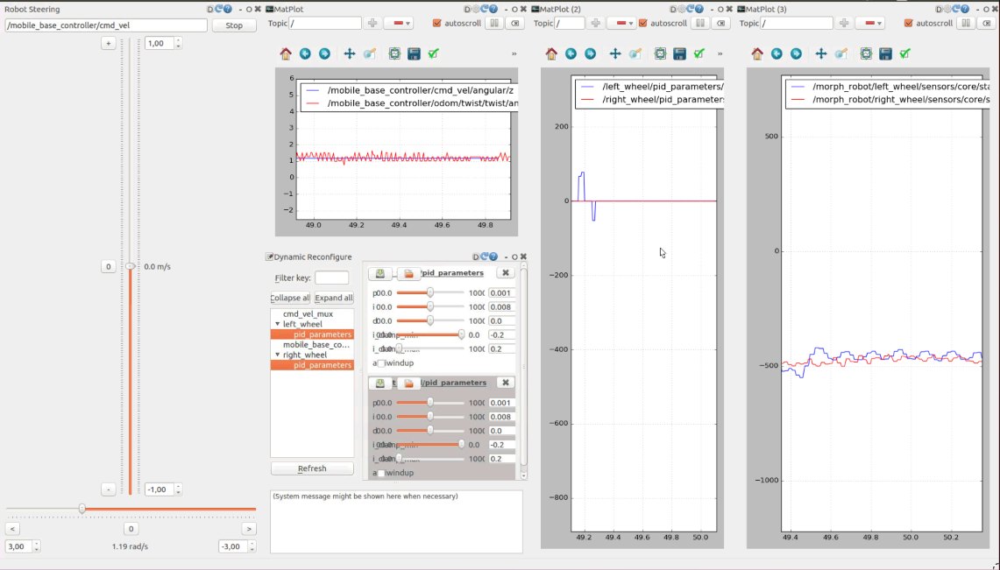

# morph_hw PID parameters tuning procedure

This document describes a method to tune the PID parameters used for the left and right motors for the morph platform.
In order to tune the parameters the robots needs to be able to move. In order to reduce the required space, the robot will be rotated in place
so the robot can move for a long time while the parameters are adjusted.

## Tuning goals

- system needs to be stable at different loads (zero load to 100KG)
- use fully charged battery
- tune first at zero load
- tune second at 75KG load
- test zero load with adjusted values to see if there's no overshoot / instability

## Background information

- the commanded speed (cmd_vel  Twist message) is send to the mobile_base_controller
- the plugin 'diff_drive_controller' uses the URDF of the robot to determine wheel diameter and distance between the wheels in order to translate the robot speed (linear/x in m/s) to wheel speed (angular rotation in rad/s) and to determine the odometry
  - this is visible in the log at startup of morph_bringup: `Odometry params : wheel separation 0.46, left wheel radius 0.083238, right wheel radius 0.083238`
- the requested rad/s for each wheel is translated to ERPM (electrical revolutions per minute)
- the ERPM is the actual RPM * motor poles (15 in this case)
- PID controller error is determined by the requested ERPM - actual ERPM (value returned by the VESC motor controller)
- the PID output command will determine the motor duty cycle
- the motor duty cycle will determine the current
- higher current results in higher torque, required to move a larger load
- in order to interpretate the numbers it's important to know if the numbers represent the robot (Twist messages for cmd_vel and odometry) or the wheel (debug messages from morph_hw; PID state information)
- wheel:
  - radius : 0.083238
  - circumference : 0.522999779 m
  - target speed : 1 m/s
  - rev/s for 1m/s : 1,912046699
  - rad/s for 1m/s : 12,013743723
- robot:
  - wheel separation : 0.46
  - turn circle : 1.445m
  - 1m/s --> 0.692 turns / sec --> 4,347964233 rad / s

- the morph_hw uses the PID controller class from control_toolbox, for more information see [control toolbox class reference](http://docs.ros.org/indigo/api/control_toolbox/html/classcontrol__toolbox_1_1Pid.html)

## Tuning procedure setup

- the robots needs a clear space of at least 2 by 2 meters
- the robot will turn in place and may drift a bit
- the robot will need to be monitored and will need to be stopped when there's a chance it can hit something or someone

1. Run `roslaunch morph_bringup morph_bringup.launch`
2. Run `rqt`
3. From the menu `Perspectives` choose `Import`
4. Select the file `morph_hw/rqt/pid_tuning.perspective`

## Tuning procedure

The rqt perspective provides the following tools:

- robot steering : to set the angular velocity and stop the robot when needed
- plot of the commanded angular velocity (cmd_vel/angular/z) versus the reported angular speed (odom/twist/twist/angular/z)
- dynamic reconfigure for changing PID parameters for left/right wheel
- plot of the PID error values for left/right wheel PID controllers
- plot of the left/right wheel ERPM



- set rad/s to 1.0 or higher, too slow speeds may cause the wheels to shake instead of rotate
- watch and listen to the robot movement, first make sure the movement is stable, not shaking and sounds smooth
- check the graphs, there may still be a difference between the wheels, adjust PID parameters to correct differences
- test with increased speed
- stop the robot and test with reversed speed
- the screenshot above shows a stable tuned result:
  - the errors are mostly zero, there may be some small spikes, but nothing serious
  - the left/right speeds are very close
  - the odometry speed is oscillating with a small wave around the requested speed

## PID tuning

There's a lot written about PID tuning. There are several approaches, one common is the Ziegler-Nichols method. In this method you start with I and D term with 0.0 values. Increase the P-term until a stable oscillation occurs. Then use the I and D term to further tune the result to reach the requested value and dampen the oscillation. See [wikipedia entry](https://en.wikipedia.org/wiki/PID_controller#Ziegler%E2%80%93Nichols_method) for more information. You can introspect the values used by the PID controller by checking the pid_parameters/state topic for each wheel. 

```console
$ rostopic echo -n1 /left_wheel/pid_parameters/state 
header: 
  seq: 11254
  stamp: 
    secs: 1567587842
    nsecs: 539151312
  frame_id: ''
timestep: 
  secs: 0
  nsecs:   4999812
error: 0.0
error_dot: 0.0
p_error: 0.0
i_error: -10.7037329196
d_error: 0.0
p_term: 0.0
i_term: -0.0856298633566
d_term: 0.0
i_max: 0.2
i_min: -0.2
output: -0.0856298633566
---
```

## Anti-windup and i_min / i_max

If anti-windup is disabled, the error over time will accumulate in i_error. To set the maximum influence of the i_term the i_min and i_max values are set to which the value is clamped. You can inspect the i_term in the state message.
